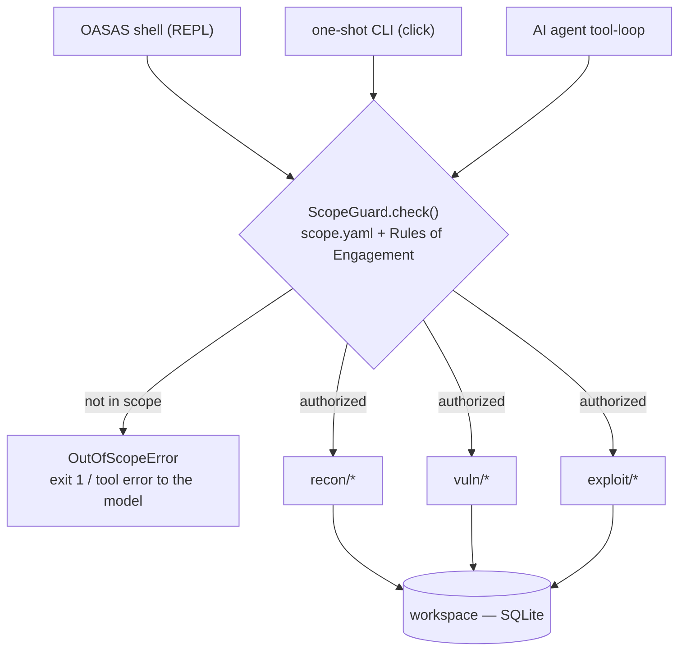
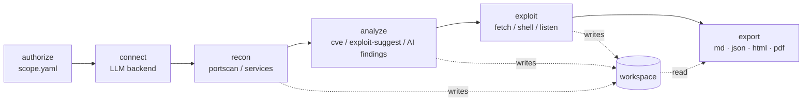
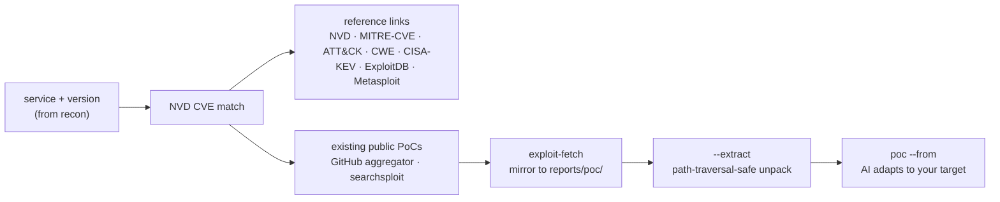

<span style="color:red">
ÅÅÅÅÅÅÅÅÅÅÅÅÅÅÅÅÅÅÅÅÅÅÅÅÅÅÅÅÅÅÅÅÅÆÆÆƯ``````````````````````````ÆÆÆÆÆÆÅgÆÅüÅÆÅÅÆÅÇÆÆÆÆÆÅÅÅÅÅÅÅÅÅÅÅÅÅÅ
ÅÆÆÆÆÆÆÆÆÆÆÆÆÆÆÆÆÆÆÆÆÆÆÆÆÆÆÆÆÆÆÆÆÆÆ‹``````````````````````````````ÆÆÆÅÅÆÆÆÞÆÆÇ`3GÅÅÅÅÆÆÆÆÆÆÆÆÆÆÆÆÆÆÆÅ
ÅÆÆÆÆÆÆÆÆÆÆÆÆÆÆÆÆÆÆÆÆÆÆÆÆÆÆÆÆÆÆÆÆÆ`````````````ÞÆÆÆÆÆÆÆÆÆÆÆÆÆÆÆ````ÇÆÆ6üÅÆ`Þ33ÆÆÆÆÆÆ3ggüüÅÆÆÆÅÆÆÆÆÆÆÅ
ÅÆÆÆÆÆÆÆÆÆÆÆÆÆÆÆÆÆÆÆÆÆÆÆÆÆÆÆÆÆÆÆÆ`````````ÅÆÆÆÆgüü3Ç63‡¯¯*`¯‹‡GÆÅ````‹````üÅÅ```‡ÅÅÇ*ÆŇÅÇÅgÆÆÆÆÆÆÆÆÅ
ÆÆÆÆÆÆÆÆÆÆÆÆÆÆÆÆÆÆÆÆÆÆÆÆÆÆÆÆÆÆÆÆ6``````ÇÆÆGü‡3l‡‡*````````````*36‡l```ÆÆÆÆÆÆÆÆÅ``lÅÆÆÆÆÆÆÆÆÅÆÆÆÆÆÆÆÆÅ
ÅÆÆÆÆÆÆÆÆÆÆÆÆÆÆÆÆÆÆÆÆÆÆÆÆÆÆÆÆÆÆÆ````ÆÆÆÆG66‡*¯‹‹‹```````````````¯ÇG3```ÅÆÆ``Å`ÆÆÆÆÆgÅÅÅÅÆÆÆÆÆÆÆÆÆÆÆÆÅ
ÅÆÆÆÆÆÆÆÆÆÆÆÆÆÆÆÆÆÆÆÆÆÆÆÆÆÆÆÆÆÆÆ``¯ÆÆÅ3l3*```¯¯``````¯‹‹¯`¯üGÅÅÆÅÅgÆÅ``¯``‹```GÅÆƯg‹GŇ3ÅÞÅÅÅgÆÆÆÆÆÅ
ÅÆÆÆÆÆÆÆÆÆÆÆÆÆÆÆÆÆÆÆÆÆÆÆÆÆÆÆÆÆÆÞ`‡ÆÆl```````‹`````lgÅü`‹¯Å3```````ÆÆÆÆ```GÆ``‹``‹ÅÅÆÆÆÆÆÆÆÆÅÆÆ6ÅÆÆÆÆÆ
`ÆÆÆÆÆÆÆÆÆÆÆÆÆÆÆÆÆÆÆÆÆÆÆÆÆÆÆÆÆÆÆ`ÆÆ6l`````ÇÞggü‹lÅg‹¯``````````````ÅÆÆÅ``Æ``ÆÆÅÅ‹üÇ```‹```GÆÆÅgÅÆÆÅÅÆ
ÅÆÆÆÆÆÆÆÆÆÆÆÆÆÆÆÆÆÆÆÆÆÆÆÆÆÆÆÆÆÆÆ`ÆG‹``````````*`````````````l‡```l```ÅÆ*lÆÆÆÆ``ÆÆÆÅ‹ÆÅ‹lÆ``¯ÆÆÆÆÆÆÆÆÆ
ÅÆÆÆÆÆÆÆÆÆÆÆÆÆÆÆÆÆÆÆÆÆÆÆÆÆÆÆÆÆÆÆ`Þ‡```ügÅÅÅÅ``````````````````````````gÆ````ÆÆÆÆÆÞÅÆÆÆÅƯgÆ`ÆÆÆÆÆÆÆÆÅ
ÅÆÆÆÆÆÆÆÆÆÆÆÆÆÆÆÆÆÆÆÆÆÆÆÆÆÆÆÆÆÆÆ``6GÆÆ‹````````````````````‹```````‡*¯¯ÅÆ`g``ÆÆgÆÆÆÆÆÆÆÆÆÆÆÆÆÆÆÆÆÆÆÆÅ
ÅÆÆÆÆÆÆÆÆÆÆÆÆÆÆÆÆÆÆÆÆÆÆÆÆÆÆÅÅÆÅÞ‹`lÆÅ````````````````````````````¯lÇ663GÆ``Æ`ÆÅÆÆÆÆÆÅÆÆÆÆÆÆÆÆÆÆÆÆÆÆÆÅ
ÆÆÆÆÆÆÆÆÆÆÆÆÆÆÆÆÆÆÆÆÆÆÆÆÆÆÅÆÅ3‹ÆÆ``‹``````````````lÆÅ``````*gÅÅgÞÇ3l``ÅÅÆÆ```ÆÆÆÆÅÆÆÆÆÆÆÆÆÆÆÆÆÆÆÆÆÆÆÅ
ÅÆÆÆÆÆÆÆÆÆÆÆÆÆÆÆÆÆÆÆÆÆÆÆÆl‡ÆgÆ‹ÆÆÆ`*`````````l````l3Ç````*¯3GÅGLJl‡```6ÞÅÆ``lÅlgÆÅÆÆÆÆÆÆÆÆÆÆÆÆÆÆÆÆÆÆÅ
gÅÅÅÆÆÆÆÆÆÆÆÆÆÆÆÆÆÆÆÆÆÆÆÆÆÆÆÆÆ‹`ÆÆƇ````````````ü```‹lÇ‹``````l6ü¯````¯`üÆ``üÆÆÆÆÆÆÆÆÆÆÆÆÆÆÆÆÆÆÆÆÆÆÆÅ
ÅÆÅÅÅÅÅgÅÅÅÅÅÅÅÆÅÅÅÅgÅÆÆÆÆÆÆÆÆÆÆÆÆÆÆ```Æl``ÅÆÅgl¯‹ÆÆÆÆÆ6ÆÆgÆÅ```````‹G‹`‡Æ‹`‡ÆÆÆÆÆÆÆÆÆÆÆÆÆÆÆÆÆÆÆÆÆÆÆÅ
ÅÆÆÅÅÆÆÆÆÆÆÆÆÆÆÅGÅÆÆÆgÆÆÆÆÆÆÆÅl6ÅÆÆ`ÇgÆÆÅÅgÞgÅ‹6ÆÆ```````````Çü``````*6``g3ÆgÆÆ33ÅÆÇGÅÆÆÆÆÆÆÆÆÆÆÆÆÆÆÅ
3‡6ÅÅÅÅ3ÅÆÆÅG‡*Å*ÆÆÆÆÆÆÆÆÆÆÆÅÅÆÆÆÆÆ``ÆÆÅGGgÅ6````````````````*‡Gǯ```l‡````ÆÆGÆÆÅÆÆÅÆÅÆÆÆÆÆÆÆÆÆÆÆÆÆÆÅ
gÆÆÆÅÅÆÆÅGl`lÆ3üÅÆÆÆÆÆÆÆÆÆÆÆÆƯgÅÆÆÆ```````````¯``````````````````l¯`¯`````6ÆÞlg*ÆÆÆÞÆÆÆÆÆÆÆÆÆÆÆÆÆÆÆÆ
*üÅÆÇl‹ÇGÅÆÆÆÅÅGÅÆÆÆÆÆÆÆÆÆÆÆÅÆÅÆÆÆÆÆÆü````````‹ÅÆ`````6ÆÆů`````````l3`````Å`````ÆG‡``````ÆÆÆgÅÆÇÞÆÆÅ
`‡``‹*`36ÅÅÅÆÆÆ3````GÅÆÆÆÆÆÆÅÆÅÆÆÆÆÆÆÆü```````G```gÆl```````````````¯3‹``````ÆÆ```````‡G33ÅÅl`üÇÆÆÆÅÅ
`Þ`GÅ*ÇÅGgÅÞÅÆÆÆÆÆÆÆÆggÅÆÆÆÆÆÆÆÆÆÆÆÆGÅÆ3``````¯`ÅÅ```````*ÆÆÆÆÆg``````¯‹```Ç`¯‹Ç‡‡ÆÆGÇ``````¯``3Å*l¯*
`GGGÆü``‡ÆÆÅÆÆÆÆ``3ÅÆÅÅÅü*ÞÅ6ÅüÅÅGÅGüüGƇ``````````6ÆÆÆÆÆÆ````````````````ÅÞÅ``````````‹ÇÆÆÅGÇ*‡‹ÞÆÆÅ
``````‹`Å*`¯``ÇÆÆÅÅü``gÅÅÆÆÆ6*ÇÅÆÅü¯‹ÞÞ*Æ````````ÆÆÅü````````````````ü3``¯g``ÆÆÆÆÆ``Æ```l3*lGü*ÇGÇÞGÞ
``‹ÆÆÆ``````¯``*ÆÅÅ`ÆÅ`gÅÅÅÇGÞ*ÅÆÅÆÆÆÅg3lÆÆ```````````````````````````````Þ6‹Þ3``ÆÆ*Å*`‹`6*``Ågl¯`¯‡¯
`Ç`````‹ÅÅ```ÞƯ``````6`ÞÅÆÅÆÆÆÆÆÇÅ‹`ÅG`‹Å`Å````````````ÅÆÆÆÆů‹‹```````````*ÇÆ`````Å``ÅlÇLJ‹¯Ç`3¯ü``
````````ůÅÆggl`ÅÆÆÆG`ÅÆÅ3ÞÅÆÅÆÅÅ3ÆÆÅl``‡Þ``ÇÆ````````33```````````````````Ň`¯``Ƈ`Gü`‹`g3`¯`Å`‹ü```
`6ÅÆÆÆÅÞ*`Ç`*ÅÆÆÆl‹3*`¯ÅÆÆÅ6ÇgÅ6ÇÅÆÆÆÆÅ3`ÆÆ``ü``````````````````````````````ÆÆl```6`Æ``3``‹¯`G6``````
`ÇüüG6``Æ``‹üGÞ``GÆÇÅÆÆÅÆÆÅ6ÇÇÆÅÆÆů3gÆÆÆ````Æ``````````````````````````````ÆÇÇlÆl````¯Å‹¯‹‹``¯Þü‹Þ¯`
`‡ÞÞ‡gÅÆƇÆü```````ü6*¯ÇÞüÆÆÅÅ*ÅÅÅÆÇ*Å``````Æü``````````````````````````````Æ``‹`Å``````Ç6*``Æ``‹`¯``
```````l```ÅÆ````lÅ`¯6*‹``ÅÅÅÆÆgggÅ6````````ÆÆ`````````````````````````````‡`````‡```````````3```````
ÆÆÆÆÆÆÆG``ü```üÆÅÆ```Å`ÞÅ‹3``¯6Å`````````````Æ````````````````````````````‡````````````````````‡Åg‹``
ÞÆÆÆÆÆÆÆÇ```¯‹``ÞÆGÅ`‹G3*`Åü`‡````````````````Æ````````````````````````````````````````````````````*`
`ÆÆÆÆÆÆÆ`üG`¯`¯`¯`````````‡3l````````````*````GÆ‹`````````````````````````````````````````````````¯``
`ÆÆÆÆÆ``ÆÆÅÆÆÆÆÆÆÆÆÅ```¯¯```````‹``````````````‹``Þü`````````````````````````````````````````````````
``````````ÅÅ‹lÇÅÆÅÆÆÇ‹`````¯```````````````ü````Ň*`GÆÆÆÆ```````Æ````````````¯```````````````````````
```````````‡Çgü``Æ`````*```````````````````‹¯````GG*``````````¯l``````````¯6‹````````````````````````
``Ƈ````ÆÆ```````Å```*‹````````````‹¯‹‹`````‹ü`````ÆÅÞ*```````````````‹3ÅÅü`````‡````````````````````
Å``3ÆÆÆÇ‹¯ÅÅ`ÆÆÆÅG``‹¯```````````````````````¯3‡``````gÞ*‡‡‹**¯lÇGÅgGÅÇ```````‡‹`````````````````````
ÆÆÆg`‹ÇgÆÆÆÆ‹````````````````````````````````````````````````````````````````````````````````````````


 ██████╗  █████╗ ███████╗ █████╗ ███████╗
██╔═══██╗██╔══██╗██╔════╝██╔══██╗██╔════╝
██║   ██║███████║███████╗███████║███████╗
██║   ██║██╔══██║╚════██║██╔══██║╚════██║
╚██████╔╝██║  ██║███████║██║  ██║███████║
 ╚═════╝ ╚═╝  ╚═╝╚══════╝╚═╝  ╚═╝╚══════╝
        Offensive Automation & Scope-Aware Suite
</span>

<div align="center">

**A single-package pentest / CTF toolkit** — recon, payload templating,
CVE→PoC exploit intelligence, and a provider-agnostic AI layer, with every
network action gated by a written authorization file.


&nbsp;
&nbsp;

</div>

Run it as an interactive shell (`python -m exploit_builder`) or as one-shot
subcommands. The AI backend is your choice: local Ollama, any OpenAI-compatible
server, or Anthropic.

```text
┌ OASAS · at a glance ─────────────────────────────────────────────┐
│  recon      portscan · services · fingerprint · dirscan · dns    │
│  vuln intel NVD CVE  ->  reference links · CWE · public PoCs     │
│  exploit    reverse shells · msfvenom · reverse-shell listener   │
│  ai         analyze · poc · chat · autonomous scope-gated agent  │
│  workspace  SQLite — hosts / findings / loot / notes persist     │
│  safety     every network action gated by config/scope.yaml      │
└──────────────────────────────────────────────────────────────────┘
```

## Contents

1. [The one rule everything hangs off](#the-one-rule-everything-hangs-off)
2. [Setup](#setup)
3. [Engagement flow](#engagement-flow)
4. [Choosing an LLM backend](#choosing-an-llm-backend)
5. [Command reference](#command-reference)
6. [Exploit intelligence pipeline](#exploit-intelligence-pipeline)
7. [Rules of Engagement](#rules-of-engagement)
8. [One-shot commands](#one-shot-commands)
9. [Project layout](#project-layout)
10. [Testing](#testing)
11. [Extending it](#extending-it)
12. [Responsible use](#responsible-use)

---

## The one rule everything hangs off

Nothing that touches a network target runs unless that target is written down
first. `config/scope.yaml` is your authorization record; `ScopeGuard` is the
single choke point every caller passes through — the shell, the one-shot CLI,
and the AI agent's own tool calls alike. An out-of-scope request comes back as
an error, never a silent bypass.



Payload *generation* (reverse shells, web-test markers, cyclic patterns, PoC
drafting) has no network side effects at all — it only produces text/code for
you to use in your own tooling, so it sits outside the gate.

---

## Setup

```bash
pip install -r requirements.txt
cp config/scope.yaml.example config/scope.yaml   # edit: your authorized targets
cp config/llm.yaml.example  config/llm.yaml      # optional: pick an LLM backend
```

`config/scope.yaml` ships authorizing only `127.0.0.1`, `localhost`, and a
sample lab CIDR. Edit it before running any active module.

---

## Engagement flow

A run walks through six stages. Recon, analysis, and exploitation all persist
into one SQLite workspace; `export` reads back whatever has accumulated there,
so you don't have to run every stage, or run them in order, for the report to be
complete.



```
$ python -m exploit_builder                 # animated intro + REPL
oasas> targets                              # what scope.yaml authorizes
oasas> connect ollama llama3.1              # wire up a local agent, no API key
oasas> workspace new lab                    # named, persistent engagement
oasas> recon 192.168.56.10 analyze          # scan + AI analysis
oasas> exploit-suggest 192.168.56.10        # services -> CVEs + links + public PoCs
oasas> export html                          # report from everything recorded
```

---

## Choosing an LLM backend

Selection precedence (highest first): CLI flags → env vars → `config/llm.yaml` →
built-in default (`anthropic` / `claude-opus-5`).

Wire a backend from inside the shell with `connect` — no environment fiddling:

| Command | Backend |
|---|---|
| `connect ollama llama3.1` | local Ollama (no API key) |
| `connect local http://localhost:1234/v1` | local OpenAI-compatible (LM Studio / llama.cpp / vLLM) |
| `connect anthropic --key sk-ant-...` | Anthropic cloud |
| `connect` · `connect test` · `connect save` | show / probe / persist the active backend |

Or from the command line and environment:

```bash
python -m exploit_builder --provider ollama --model llama3.1 recon 127.0.0.1 --analyze
python -m exploit_builder --provider openai_compatible --model gpt-4o-mini poc "..."
python -m exploit_builder providers          # show what's active
```

Environment equivalents: `EBF_PROVIDER`, `EBF_MODEL`. API keys are read from the
env var each provider expects (`ANTHROPIC_API_KEY`, `OPENAI_API_KEY`, or the
`api_key_env` you set for an OpenAI-compatible endpoint). On Windows PowerShell:

```powershell
$env:ANTHROPIC_API_KEY = "sk-ant-..."
```

The `anthropic` package is only needed for the Anthropic provider; drop it if you
run purely local / OpenAI-compatible.

---

## Command reference

### Recon

| Command | Does |
|---|---|
| `recon <target> [analyze] [report]` | TCP connect scan + banner grab, optional AI analysis/report |
| `services <target>` | service/version detection (`nmap -sV` if installed, else banner) |
| `fingerprint <host\|url>` | HTTP tech + security headers + TLS cert + robots |
| `dirscan <host\|url> [wordlist]` | directory/content brute-force |
| `subdomains <domain>` · `dns <domain>` | DNS brute-force · records + crt.sh |

### Vulnerability & exploit intelligence

| Command | Does |
|---|---|
| `cve <product> [ver]` · `cve hosts` | NVD lookup for a product / all recorded services |
| `exploit-suggest <host>` | recorded services → CVEs + reference links + existing public PoCs |
| `exploit-suggest <CVE>` | one CVE → all reference links + live GitHub PoCs |
| `exploit-fetch [--extract] <CVE>` | mirror existing public PoCs to `reports/poc/<CVE>` for review (no exec) |
| `nuclei <host\|url>` · `webscan <url> [param]` | nuclei templates · active XSS/SQLi probe |

### Payloads & exploitation

| Command | Does |
|---|---|
| `shell <template> <lhost> <lport>` | render a reverse-shell one-liner |
| `web <category>` · `encode <enc> <payload>` | web-vuln markers · base64/url/hex/powershell |
| `pattern <length> [hex]` | cyclic pattern, or find the offset of a captured value |
| `msfvenom <payload> <lhost> <lport> [fmt] [out]` | payload generation (needs msfvenom) |
| `listen <port>` · `sessions` · `interact <id>` · `kill <id>` | reverse-shell handler |

### AI

| Command | Does |
|---|---|
| `poc <description...>` | AI drafts PoC code for a vulnerability you've identified |
| `poc --from <file> <description...>` | AI adapts an existing local PoC to your target |
| `chat <message...>` | grounded, streaming chat about the engagement |
| `agent [--background] <goal...>` | autonomous orchestrator; every tool call still scope-gated |
| `agents` · `usage` · `context` | agent sessions · token cost · AI context |

### Workspace, governance, meta

| Command | Does |
|---|---|
| `workspace new\|use\|list <name>` | engagement workspace (persists hosts/findings/loot) |
| `findings` · `hosts` · `loot` · `notes` · `audit` | view persisted data · action audit log |
| `export md\|html\|json\|pdf` | export a report of the workspace |
| `set dry-run on` · `set proxy <url>` · `set theme <name>` | log-only mode · SOCKS/HTTP proxy · recolor |
| `menu` · `providers` · `targets` · `status` | interactive menu · info panels |
| `!<cmd>` | run a system command (no LLM, no scope gate) |

Tab autocompletes commands, templates, and scope targets; ↑/↓ walk history. On a
terminal that can't host the full TUI, OASAS falls back to a plain prompt.

---

## Exploit intelligence pipeline

The `exploit-suggest` / `exploit-fetch` / `poc` chain automates everything
*around* an exploit without shipping a library of weaponized code.



For each CVE, `exploit-suggest` prints deterministic, always-valid reference URLs
(NVD, MITRE CVE record, ATT&CK, the concrete MITRE **CWE** page, CISA KEV,
ExploitDB, Metasploit) plus a live lookup of real public GitHub PoC repos and any
local `searchsploit` matches:

```text
oasas> exploit-suggest CVE-2021-41773
[INFO] CVE-2021-41773
    NVD        https://nvd.nist.gov/vuln/detail/CVE-2021-41773
    MITRE-CVE  https://www.cve.org/CVERecord?id=CVE-2021-41773
    ATT&CK     https://attack.mitre.org/techniques/enterprise/
    CWE-22     https://cwe.mitre.org/data/definitions/22.html
    ExploitDB  https://www.exploit-db.com/search?cve=2021-41773
    Metasploit https://www.rapid7.com/db/?q=CVE-2021-41773&type=metasploit
    GitHub PoCs (5):
      [139*] https://github.com/inbug-team/CVE-2021-41773_CVE-2021-42013
      [51*]  https://github.com/thehackersbrain/CVE-2021-41773
      [5*]   https://github.com/Hydragyrum/CVE-2021-41773-Playground
```

**Design boundary.** The framework is an assistant, not an autonomous weaponizer:

- The AI agent has a **read-only** `lookup_exploit_intel` tool — it can pull
  *references* to existing PoCs during a run, but never downloads or runs code.
- `exploit-fetch` is an explicit, human-invoked command. It mirrors public PoCs
  to `reports/poc/<CVE>/` for review and writes a `SOURCES.md` provenance file.
  Nothing is executed; GitHub repos arrive packed. `--extract` unpacks them
  through a path-traversal-safe extractor (rejects `../` escapes, symlinks, and
  device members). `reports/poc/` is gitignored — downloaded third-party code
  never enters your repo.

---

## Rules of Engagement

The `roe:` block in `config/scope.yaml` enforces more than the target list:

| Field | Effect |
|---|---|
| `valid_from` / `valid_until` | engagement validity window; outside it, every active action is refused |
| `allowed_windows` | permitted time-of-day windows (local time) |
| `rate_limit` | throttle outbound connections (requests/sec, max concurrency) |
| `dry_run` | active actions are logged to the audit trail but send no packets |

Every active action is checked against the RoE and written to the per-workspace
audit log. Toggle log-only mode live with `set dry-run on`.

---

## One-shot commands

Every feature is also a normal subcommand for scripting:

```bash
python -m exploit_builder recon 192.168.56.10 --analyze --report
python -m exploit_builder payload shell --template python3 --lhost 192.168.56.1 --lport 4444
python -m exploit_builder payload pattern --length 200 --offset-of 6341346c
python -m exploit_builder poc "Stack buffer overflow at offset 76, no canary, x86 Linux" --language python
python -m exploit_builder agent "Enumerate 192.168.56.10 and write a report"
```

---

## Project layout

```
exploit_builder/
  core/            scope enforcement, config, shared data models, workspace (SQLite)
  modules/
    recon/         port scan, service detect, fingerprint, content discovery, DNS
    vuln/          NVD CVE lookup, exploit_intel (links + PoC fetch), nuclei, webscan
    payloads/      reverse shells, web-vuln markers, encoders, cyclic patterns
    exploit/       msfvenom wrapper, reverse-shell listener
    ai/            provider layer + analyst, report writer, PoC assistant, agent
      providers/   anthropic, ollama, openai_compatible backends + factory
    report/        markdown / html / json / pdf rendering
  tui/             OASAS shell: art, effects, intro, state, actions, shell, menu
  cli.py           command-line entrypoint (launches the shell by default)
config/            scope.yaml · llm.yaml · oasas.yaml (all gitignored — copy from .example)
reports/           generated reports; reports/poc/ holds fetched PoCs (gitignored)
workspaces/        one SQLite db per engagement (gitignored)
```

---

## Testing

There is no automated pytest suite yet; the framework is verified with the
reproducible manual pass below. Every active command is exercised against the
`127.0.0.1`/`localhost` targets the shipped `scope.yaml` authorizes.

```bash
# 1. imports / syntax
python -m compileall -q exploit_builder

# 2. scope gate — blocks the unauthorized, allows the authorized
python -m exploit_builder recon 8.8.8.8        # -> Blocked (not in scope)
python -m exploit_builder recon 127.0.0.1      # -> proceeds

# 3. full engagement flow (in the shell)
workspace new t; recon 127.0.0.1; services 127.0.0.1; hosts
exploit-suggest CVE-2021-41773
export md; export json; audit

# 4. exploit-fetch with safe extraction
exploit-fetch --extract CVE-2021-41773         # mirrors + unpacks public PoCs

# 5. offset finder handles both byte orders
python -m exploit_builder payload pattern --length 200 --offset-of 6341346c
```

Observed results (Python 3.11, Windows 11):

| Check | Result |
|---|---|
| `compileall` over the whole package | pass |
| Scope gate blocks `8.8.8.8`, allows `127.0.0.1` | pass — blocked action recorded in audit log |
| `recon` / `services` on `127.0.0.1` | 135/msrpc, 445/smb detected and persisted to SQLite |
| `export md \| json \| html` | all include hosts + open ports |
| `exploit-suggest CVE-2021-41773` | NVD/MITRE/ATT&CK/Metasploit/GitHub links + **CWE-22** + 5 live GitHub PoCs |
| `exploit-fetch --extract` | 3 repos mirrored and safely unpacked (12 files); `SOURCES.md` written |
| Malicious tarball (`../` escape + symlink to `/etc/passwd`) | both members rejected; nothing written outside the sandbox |
| `pattern --offset-of` | resolves for both big- and little-endian input |
| `set dry-run on` then `recon` | logged as `dry-run`, zero packets sent |

Priority for a real test suite: `core/scope.py` (CIDR matching, never-touch
denylist, RoE time-window math) and `modules/vuln/exploit_intel._safe_extract`
(archive hardening) — both are pure logic and easy to pin down.

---

## Extending it

- **Recon module** — add a scope-gated function under `modules/recon/`, wire it
  into `cli.py` and (optionally) the agent orchestrator's tool list.
- **Payload template** — add to the relevant dict in `modules/payloads/`.
- **AI capability** — add a function to `modules/ai/` that takes a `provider` and
  calls `provider.complete()` / `complete_json()` / `chat()`; it works across
  every backend automatically.
- **LLM backend** — subclass `BaseProvider` in `modules/ai/providers/`, implement
  `chat()`, and register it in the factory in `providers/__init__.py`.
- **Drop-in plugin** — a `.py` in `plugins/` exposing `register(api)` adds shell
  commands without touching core (see `plugins/example.py`).

Optional external tools auto-detected on PATH: **nmap**, **nuclei**, **msfvenom**,
**searchsploit**. Optional Python extras: `weasyprint` (PDF export), `pysocks`
(SOCKS proxy). All degrade gracefully when absent.

---

## Responsible use

Only point this at systems you own or have explicit written authorization to test
— your own lab VMs, or CTF/training platforms (HackTheBox, TryHackMe, PortSwigger
Labs). `config/scope.yaml` is your authorization record; keep it accurate, and
don't share generated payloads, fetched PoCs, or reports outside that
authorization. Downloaded PoC code (`reports/poc/`) is untrusted third-party
material — read it before running anything.

MIT licensed. Made by aknxpp / sigmawolf.
